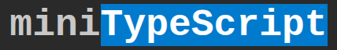

<h1 align="center" style="text-align: center; font-family: 'Courier New';">
    
</h1>
Welcome to miniTypeScript (or miniTS), a typing speed test game where you type random words as fast as you can (if you know <a href="https://monkeytype.com">monkeytype</a>, it's basically that).
 
    This is a pet project by <a href="https://matthy.dev">matthy.dev</a> to practice TypeScript, hence the name.
<h3>Customization</h3>
There is a lot of ways you can change the type of test, and you can customize this by adding more:
<ul>
    <li>
        Test time limits
        <ul>
            <li>15 seconds</li>
            <li>30 seconds</li>
            <li>60 seconds</li>
        </ul>
    </li>
    <li>
        Test duration
        <ul>
            <li>10 words</li>
            <li>25 words</li>
        </ul>
    </li>
</ul>
<h2>Building local</h2>
To clone the repo, install dependencies and go into the directory via this command:

<code>git clone git@github.com:mechanikate/miniTypeScript.git && cd miniTypescript && npm install</code>

And then, build via this command:

<code>npx tsc</code>

Then, you can open <code>index.html</code> with any browser to view it locally!

<h2>Adding stuff</h2>
Adding stuff has been made as simple as possible for us.
<h3>Datasets/languages</h3>
You can add datasets in <code>src/datasets</code>, and import them with <code>importDataset(datasetPath: DatasetPath)</code>. To see the format, look at <a href="https://github.com/mechanikate/miniTypeScript/blob/master/src/datasets/example.ts">src/datasets/example.ts</a>.
<h3>Time/word formats</h3>
You can add formats in <code>index.html</code> in an appropriate category (the one with the summary containing words or the summary containing time). The label is self-explanatory, but actually getting the timer/word count to be correct must be changed in the value of the <code>input</code> element. The format is <code>[TYPE]-[WORDCOUNT]-[TIMERAMOUNT]</code>, where you replace <code>[TYPE]</code> with either <code>words</code> or <code>time</code> (whateber fits best), <code>[WORDCOUNT]</code> with the number of words (if <code>[TYPE]</code> is <code>time</code>, set this to 10 times the timer in seconds), and <code>[TIMERAMOUNT]</code> with the amount of time in seconds the user has.
